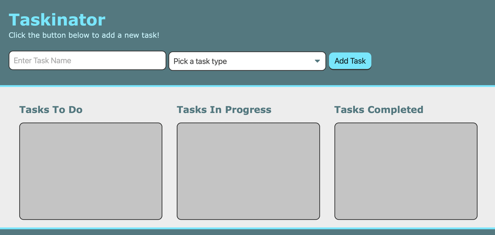

# taskinator

## Description
A Kanban-board task-tracker application called the Taskinator. Organize tasks into Tasks To Do, Tasks In Progress, and Tasks Completed.

  ## Table of Contents
* [License](#license)
* [Deployment](#deployment)
* [Mock-up](#mockup)
* [Questions](#questions)

## License

## Deployment
You can see the deployed Application [here](https://lizariasc.github.io/taskinator/).

## Mockup

## Questions
If you have any questions about this project, send me an email at lizethariasc14@gmail.com or contact me through my [GitHub](https://github.com/lizariasc).